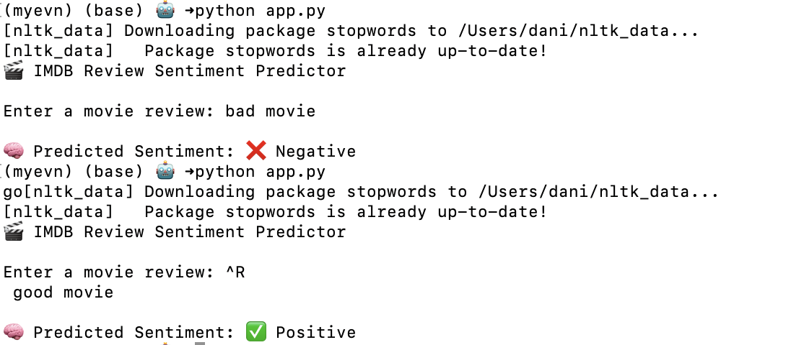

# 🎬 IMDB Movie Review Sentiment Analysis

This project analyzes sentiment (positive or negative) from IMDB movie reviews using Natural Language Processing (NLP) and machine learning. It’s designed to mimic a real-world deployment workflow — from data cleaning to model training and final prediction in a production environment.

---

## 📌 Project Highlights

- Binary sentiment classification (Positive or Negative)
- Text cleaning (stopwords, HTML removal, normalization)
- TF-IDF feature extraction
- Multiple models: Logistic Regression, Naive Bayes, Linear SVM
- Automatic best-model selection and saving
- CLI-based prediction app (`app.py`)
- Modular and production-ready structure

---

## 🧠 Concepts Covered

- Natural Language Processing (NLP)
- Text preprocessing (stopwords, lemmatization, tokenization)
- TF-IDF vectorization
- Model evaluation (accuracy, precision, recall, F1-score)
- Confusion matrix interpretation
- Train/test split with stratification
- Saving/loading models with `joblib`
- Deployable app with CLI input

---

## 🧰 Tools & Libraries Used

- Python 3.8+
- Pandas, NumPy
- Scikit-learn
- NLTK
- Joblib

---

## Output

